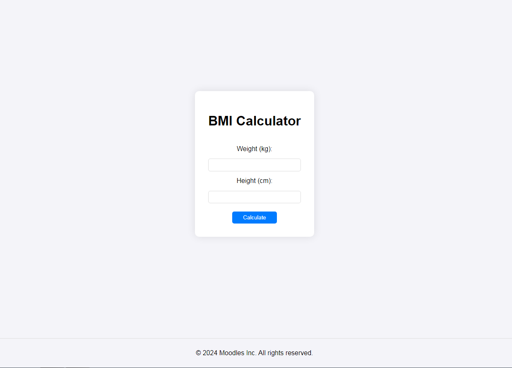

# BMI Calculator

Welcome to the BMI Calculator app, a product of Moodles Inc. This application provides a modern and beautiful interface for calculating Body Mass Index (BMI), which is a useful tool for assessing your body weight relative to your height.

## Features

- **Modern Design**: Enjoy a sleek and contemporary interface designed for a pleasant user experience.
- **Simple Calculation**: Easily calculate your BMI with just a few inputs.
- **Responsive Layout**: The app is designed to work smoothly on various devices and screen sizes.
- **Visual Feedback**: Instant visual feedback on BMI results with recommendations.

## Screenshots



## Installation

To get started with the BMI Calculator app, follow these steps:

1. **Clone the Repository**:

   ```bash
   git clone https://github.com/yourusername/bmi-calculator.git
